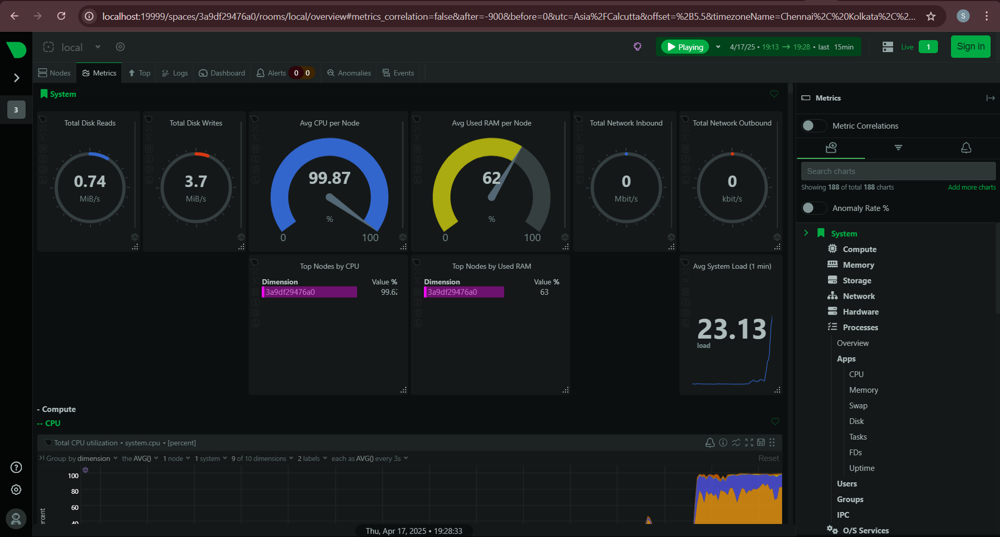

# Netdata-Monitoring-with-Docker
# 🧠 Netdata Monitoring with Docker

This project sets up **Netdata**, a real-time monitoring tool, using **Docker** on a local machine (WSL). It provides a full system dashboard for CPU, memory, disk, and network activity.

---

## 📦 Setup Instructions

```
bash docker-run-command.sh
```
Then open your browser:
```
http://localhost:19999
```
# 📸 Screenshots
## Dashboard Home
This is the main Netdata landing page showing the health overview.


## System Monitoring
Real-time system-level stats: load average, uptime, and resource usage.


## Network Monitoring
Live bandwidth per interface, packet flow, errors, and drops.
## 

## Applications / Processes


## Alerts Monitoring


## CPU Monitoring


## Disk Monitoring


## Docker Code :
If Docker containers are running, you can view per-container resource usage.


## Memory Monitoring :
RAM usage, swap activity, and memory pressure visualized over time.


## Onboard Page :
Netdata offers an onboarding view that summarizes monitored dimensions and performance trends.


📚 What is Netdata?
Netdata is a blazing-fast, real-time performance monitoring tool for your infrastructure. It collects thousands of metrics per second and presents them through a rich web dashboard.

🖥️ How do you view real-time metrics?
You can view real-time metrics through Netdata’s web dashboard at http://<server-ip>:19999, which shows interactive, per-second graphs of all monitored data.

⚙️ What is a collector?
A collector is a module or plugin in Netdata that gathers metrics from system files, services, APIs, or containers. Netdata has 300+ collectors for various use cases.

📈 What are some performance KPIs to watch?
Important KPIs include CPU usage, memory utilization, disk I/O, network traffic, system load, container resource usage, and service-specific stats like database queries or HTTP status codes.

🚀 How to deploy Netdata on a VM?
Run the official script bash <(curl -Ss https://my-netdata.io/kickstart.sh), allow port 19999 through your firewall, and access the dashboard via browser. It supports most Linux distributions.

🚨 How does Netdata alerting work?
Netdata uses preconfigured health checks to trigger alerts when thresholds are breached. It supports alerting via email, Slack, Telegram, and more. Alerts can be customized or silenced.

📊 What is a dashboard in this context?
A dashboard in Netdata is a real-time, web-based interface showing detailed system and application metrics through live-updating graphs and charts.


🛑 Stop the container
```
docker stop netdata
docker rm netdata
```

🙋‍♂️ Author
Dushyant Sharma
Aspiring DevOps/Cloud Engineer
<br>[LinkedIn](https://www.linkedin.com/in/dushyant-sharma-3619b420b/)
