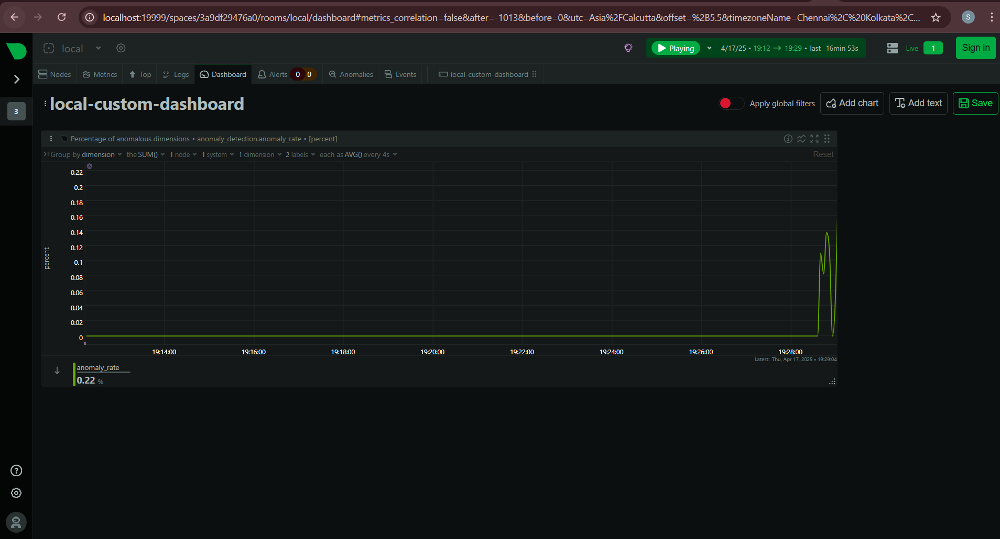
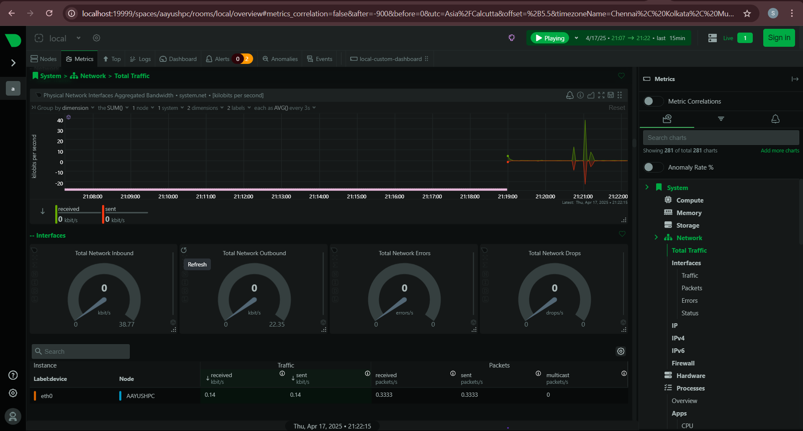
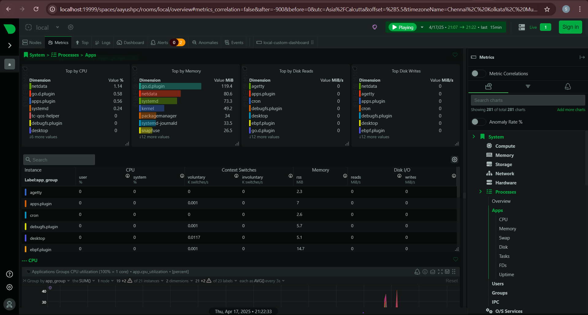
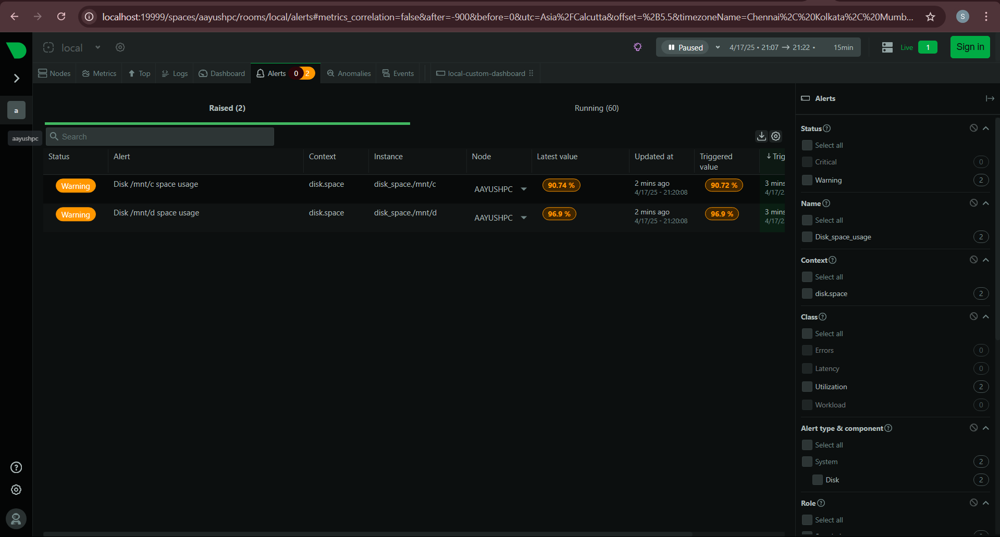
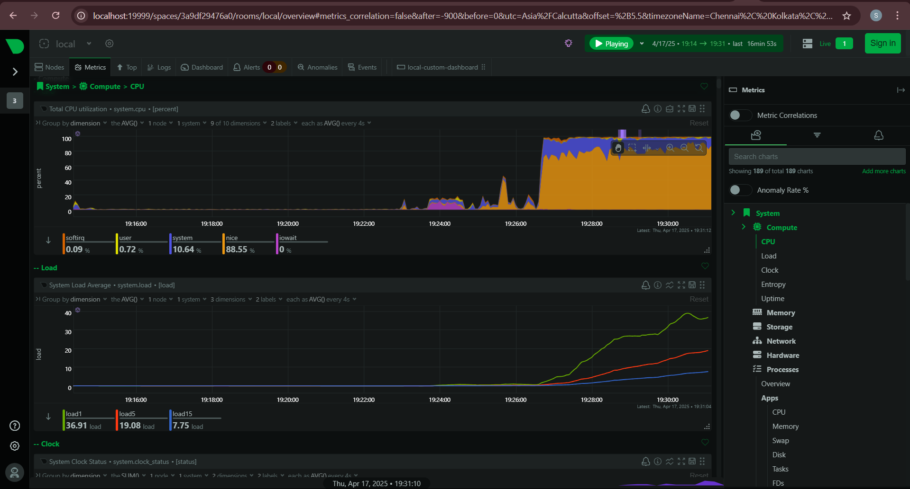
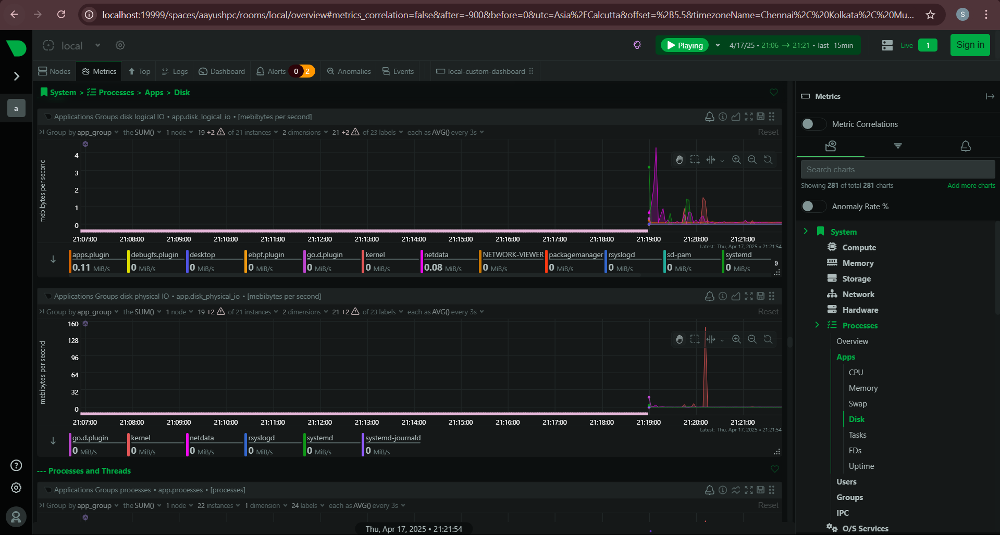
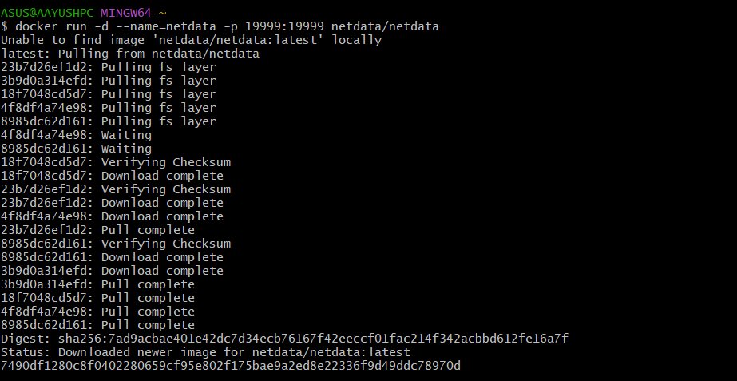
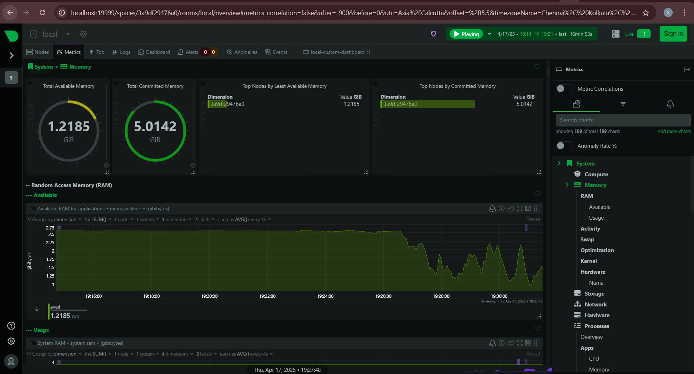
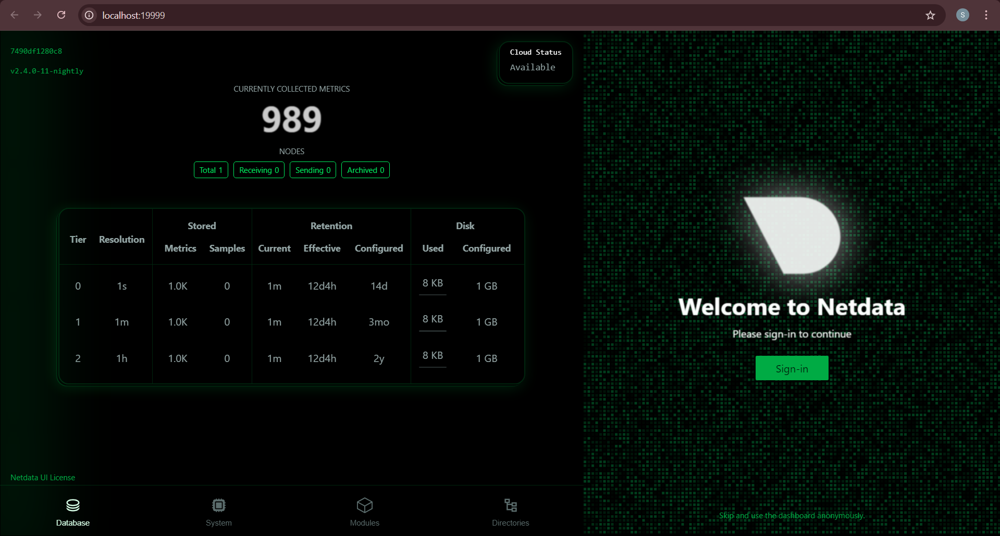

# 🧠 Netdata Monitoring with Docker

This project sets up **Netdata**, a real-time monitoring tool, using **Docker** on a local machine (WSL). It provides a full system dashboard for CPU, memory, disk, and network activity.

---

## 📦 Setup Instructions

```
bash docker-run-command.sh
```
Then open your browser:
```
http://localhost:19999
```
📸 Screenshots
Dashboard Home


System Monitoring


Network Monitoring


Applications / Processes


Alerts Monitoring


CPU Monitoring


Disk Monitoring


Docker Code :


Memory Monitoring :


Onboard Page :


📚 What is Netdata?
Netdata is a blazing-fast, real-time performance monitoring tool for your infrastructure. It collects thousands of metrics per second and presents them through a rich web dashboard.

🛑 Stop the container
```
docker stop netdata
docker rm netdata
```

🙋‍♂️ Author
Aayush Kukade
Aspiring DevOps/Cloud Engineer
[LinkedIn](https://www.linkedin.com/in/aayushkukade/) • [Medium](https://medium.com/@sroy10012001)
<br>[This Repo Blog On Medium]([https://medium.com/@sroy10012001](https://medium.com/@sroy10012001/real-time-system-monitoring-with-netdata-using-docker-2864dbf62956)
<br>[All Of My Task Blogs]([https://medium.com/@sroy10012001/my-devops-internship-journey-with-elevate-labs-30-days-of-learning-d7252e409a20)
